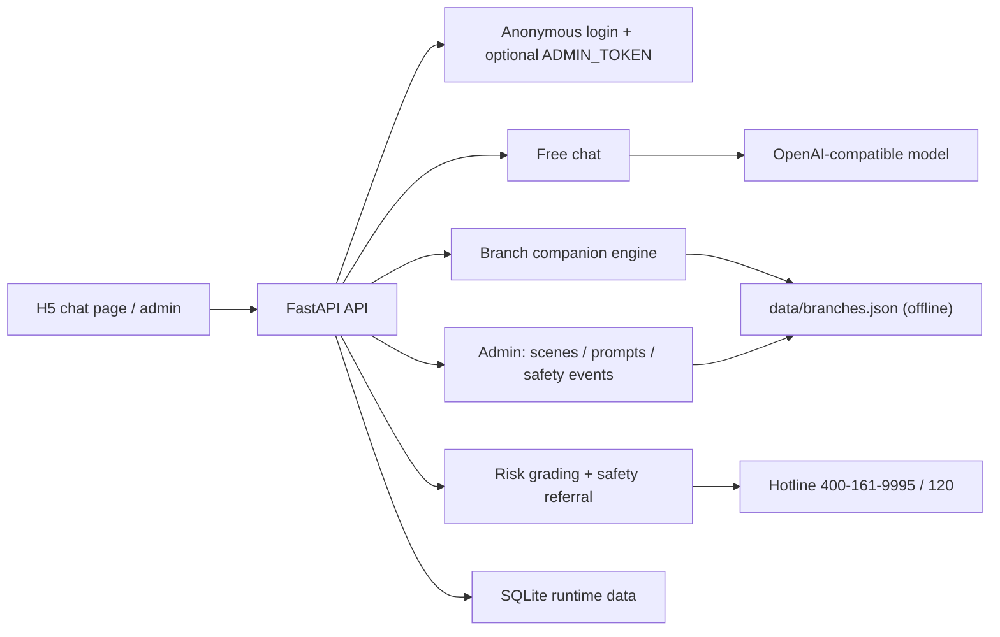

# HouMen WuFenZhong (后门五分钟)

**Language:** English | [简体中文](README.zh-CN.md)

[](https://github.com/liao96312/houmenbiegun/actions/workflows/ci.yml)


A short-term emotional companion web app. It takes the "pick an option to advance the story + technique analysis" shape from PUA manipulation simulators and **flips it**: instead of analyzing manipulation, it analyzes **companion / listening technique**. When you don't know what to say, there are written, grounded lines to lean on; behind every companion reply you can open an analysis of the listening principle it follows.

## Why This Project Exists

Most emotional-support products either lean entirely on a large model (unstable quality, high cost, dead offline) or are just a chat box. **HouMen WuFenZhong** aims for "being heard, not fixed":

- 8 **urban-night scenes**: supermarket back door, late-night convenience store, rainy bus stop, sitting in the car, last subway, downstairs from the office, empty rooftop, community bench. Each scene has someone sitting beside you.
- **Free chat** (default): OpenAI-compatible model (DeepSeek, etc.), 1–3 grounded sentences, catch feelings before solving.
- **Branch companion** ("don't know what to say"): an offline branch dialogue tree, no large model required, every line hand-written and on-point.
- **Companion-technique analysis**: toggle "解析" (analysis) to show, under each reply, the listening principle it follows (catch first, don't solve; separate today from the whole person; allow silence…).
- **Multiple endings + safety referral**: branches close on emotional trajectory (loosened up / let's stop here tonight / safety referral); on self-harm/suicide signals it drops the scene frame and gives real-world safety advice and hotlines (400‑161‑9995 / 120).

> ⚠️ This project is an emotional companion tool, **not a psychologist** — no diagnosis, no medication, no replacement for professional care. High-risk expressions are immediately routed to real-world safety resources.

## Features

| Module | Capability |
| --- | --- |
| Scenes & characters | 8 night scenes + 8 companion characters, JSON-driven, editable from admin |
| Free chat | OpenAI-compatible `/v1/chat/completions`, DeepSeek preset, 1–3 short replies |
| Branch companion | Offline branch dialogue tree, no large model, every line guaranteed on-point |
| Technique analysis | Listening-principle analysis under each reply, toggleable |
| Safety referral | Risk grading (0–3), self-harm/suicide/harm signals trigger safety reply + hotline |
| Admin | Edit scene/Prompt JSON, view safety events/feedback/conversations, CSV export |
| Data & privacy | SQLite local runtime data (generated locally, not committed), anonymous login |
| TTS | Optional server-side TTS; frontend also has a native browser read-aloud toggle |
| Deployment | Docker / Docker Compose / nginx, built-in health check |

## Scenes

| Scene | Companion | Poster |
| --- | --- | --- |
| Supermarket back door | Miss Tayama |  |
| Late-night convenience store | Clerk Xiao Lin |  |
| Rainy bus stop | Lin Yu |  |
| Sitting in the car | Zhou Cheng |  |
| Last subway | Aki (last-train passenger) |  |
| Downstairs from the office | Sister Xu |  |
| Empty rooftop | Sister Lan |  |
| Community bench | Auntie Chen |  |

## Architecture



## Core Workflows

### Free chat

1. The user enters a scene and gets the opening line.
2. Every input is risk-graded first (0–3).
3. High risk (≥2) takes the safety reply; otherwise the model returns 1–3 grounded sentences.
4. Highest risk (=3) records a safety event and suggests contacting real-world resources.

### Branch companion ("don't know what to say")

1. The user starts branch mode and gets the start node.
2. Each step offers 2–3 real, sayable options.
3. Each choice returns a hand-written companion line + technique analysis + next options.
4. It closes on an ending node (loosened up / let's stop here tonight / safety referral).

### Safety referral

On detected self-harm, suicide, harm-to-others, or a concrete method, the app drops the scene frame, gives real-world safety advice, and points to a trusted person or emergency services (120).

## Tech Stack

- Backend: FastAPI 0.115.6, uvicorn 0.34.0
- LLM: OpenAI-compatible API (DeepSeek by default)
- Frontend: vanilla H5 (`static/index.html` chat page, `static/admin.html` admin), no framework
- Data: scenes/prompts/branches as JSON; runtime data in SQLite (`data/app.db`, generated locally, not committed)
- Offline corpus: references the arksec corpus for short-line rhythm only, never copied verbatim
- Deployment: Docker, Docker Compose, nginx

## Quick Start

Zero-dependency start (Python 3.12):

```powershell
$env:AI_API_KEY="your key"
$env:AI_BASE_URL="https://api.deepseek.com/v1"
$env:AI_MODEL="deepseek-chat"
python -m app.server
```

Or:

```powershell
.\scripts\start.ps1
```

FastAPI dev mode:

```powershell
python -m pip install -r requirements.txt
python -m uvicorn app.main:app --reload
```

Open:

- Chat page: http://127.0.0.1:8000
- Admin: http://127.0.0.1:8000/admin
- Health: http://127.0.0.1:8000/health
- OpenAPI docs: http://127.0.0.1:8000/docs

Docker:

```powershell
Copy-Item .env.example .env
docker compose up --build
```

Optional TTS (off by default):

```powershell
$env:TTS_ENABLED="true"
```

## Configuration

Copy `.env.example` and fill in local values:

```env
AI_API_KEY=your OpenAI-compatible key
AI_BASE_URL=https://api.deepseek.com/v1
AI_MODEL=deepseek-chat
TTS_ENABLED=false
ADMIN_TOKEN=set a strong token before public deployment
```

Set `ADMIN_TOKEN` before any public deployment; the admin requires it when saving scenes/prompts.

## Quality Checks

```powershell
python tests_smoke.py
```

The smoke test covers scene/character integrity, risk grading, safety replies, the branch engine, and offline-corpus assertions. It **does not depend on a large model or the network**, and runs by default in CI.

## Repository Layout

```text
app/             FastAPI app: routes, companion core, branch engine, persistence
static/          Vanilla H5: chat index.html, admin.html, character avatars, scene posters
assets/          Character art and scene source assets
data/            Scenes / prompts / branches JSON (core content); app.db generated locally, not committed
docs/            Design notes: branch corpus design, character prompt refs, final writing checklist
scripts/         Start, corpus import, poster generation, character seeding
.github/         CI workflows
```

## Documentation

- [Branch corpus design](docs/branches_design.md)
- [Character prompt references](docs/character_prompt_refs.md)
- [Final writing checklist](docs/final_writing_checklist.md)

## Status

The phase-1 MVP is complete: H5 scene page + FastAPI API + OpenAI-compatible model + offline branch companion engine + safety referral + admin. Phase 2 focuses on making "companion-technique analysis" a teachable, reviewable, structured capability.
