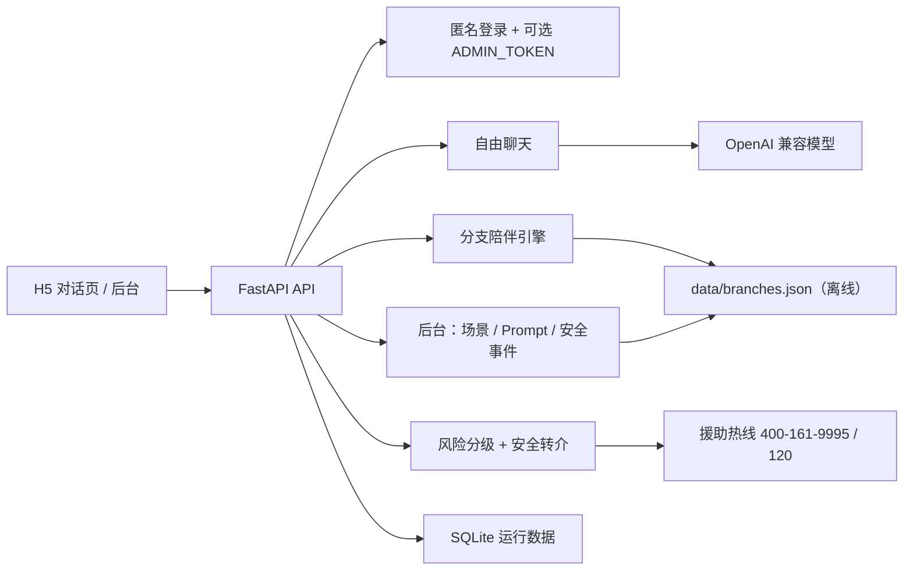

# 后门五分钟

**语言：** [English](README.md) | 简体中文

[](https://github.com/liao96312/houmenbiegun/actions/workflows/ci.yml)


一个短时情绪陪伴 Web 应用。把参考站（PUA 操控模拟器）里的「选项推进剧情 + 手法解析」**反过来**——做成**陪伴 / 倾听手法解析**：当你不知道说什么时，有写好的、能落地的人话可接；每一句陪伴背后，都能点开看它遵循了哪条倾听原则。

## 项目定位

很多情绪陪伴产品要么完全依赖大模型（质量飘、成本高、断网即瘫），要么只剩一个聊天框。**后门五分钟**想做的是「能被听到，而不是被解决」：

- 8 个**城市夜场景**：超市后门、深夜便利店、雨夜公交站、车里坐一会儿、末班地铁、公司楼下、没人的天台、小区长椅。每个场景有一个坐在你旁边的人。
- **自由聊天**（默认）：接 OpenAI 兼容模型（DeepSeek 等），1–3 句人话，先接住不解决。
- **分支陪伴**（「不知道说什么」时）：离线分支对话树，不依赖大模型，每一句都是手写的、到位的话。
- **陪伴手法解析**：打开「解析」开关，每句回复下方显示一条分析，点出背后的倾听原则（先接住不解决、把今天和整个人切开、允许沉默……）。
- **多结局 + 安全转介**：分支按情绪走向收尾（松了一点 / 今晚先到这儿 / 安全转介）；出现自伤自杀信号时退出场景感，给现实安全建议与援助热线（400‑161‑9995 / 120）。

> ⚠️ 本项目是情绪陪伴工具，**不是心理医生，不做诊断、不开药、不替代专业治疗**。遇到高风险表达会立即转现实安全资源。

## 核心能力

| 模块 | 已实现能力 |
| --- | --- |
| 场景与角色 | 8 个夜场景 + 8 个陪伴者角色，JSON 驱动，后台可改 |
| 自由聊天 | OpenAI 兼容 `/v1/chat/completions`，DeepSeek 预设，1–3 句短回复 |
| 分支陪伴 | 离线分支对话树，不依赖大模型，保证每句都到位 |
| 手法解析 | 每句陪伴回复下方显示倾听原则解析，可开关 |
| 安全转介 | 风险分级（0–3），自伤/自杀/伤人信号触发安全回复与热线 |
| 后台管理 | 编辑场景/Prompt JSON，查看安全事件/反馈/对话，CSV 导出 |
| 数据与隐私 | SQLite 本地存储运行数据（本地生成，不入库），匿名登录 |
| TTS | 可选服务端 TTS；前端另有浏览器原生朗读开关 |
| 部署 | Docker / Docker Compose / nginx，内置健康检查 |

## 场景一览

| 场景 | 陪伴者 | 海报 |
| --- | --- | --- |
| 超市后门 | 田山小姐 |  |
| 深夜便利店 | 小林店员 |  |
| 雨夜公交站 | 林雨 |  |
| 车里坐一会儿 | 周澄 |  |
| 末班地铁 | 末班乘客阿纪 |  |
| 公司楼下 | 许姐 |  |
| 没人的天台 | 岚姐 |  |
| 小区长椅 | 陈姨 |  |

## 系统架构



## 主要流程

### 自由聊天

1. 用户进入场景，拿到开场白。
2. 每句输入先做风险分级（0–3）。
3. 高风险（≥2）走安全回复；否则调用大模型生成 1–3 句人话。
4. 高风险（=3）触发安全事件记录并建议联系现实资源。

### 分支陪伴（「不知道说什么」）

1. 用户在分支模式开始，取到起始节点。
2. 每步给出 2–3 个真实可说的人话选项。
3. 每选一项，返回手写的陪伴回复 + 手法解析 + 下一轮选项。
4. 走到结局节点（松了一点 / 今晚先到这儿 / 安全转介）收尾。

### 安全转介

检测到自伤、自杀、伤害他人或具体方法时，退出场景感，给现实安全建议，并提示联系身边可信任的人或紧急服务（120）。

## 技术栈

- 后端：FastAPI 0.115.6、uvicorn 0.34.0
- 大模型：OpenAI 兼容接口（默认 DeepSeek）
- 前端：原生 H5（`static/index.html` 对话页、`static/admin.html` 后台），无框架
- 数据：场景/Prompt/分支 用 JSON；运行数据用 SQLite（`data/app.db`，本地生成，不入库）
- 离线语料：参考 arksec 语料只学短句节奏，不照抄
- 部署：Docker、Docker Compose、nginx

## 快速启动

零依赖启动（需要 Python 3.12）：

```powershell
$env:AI_API_KEY="你的 key"
$env:AI_BASE_URL="https://api.deepseek.com/v1"
$env:AI_MODEL="deepseek-chat"
python -m app.server
```

或：

```powershell
.\scripts\start.ps1
```

FastAPI 开发模式：

```powershell
python -m pip install -r requirements.txt
python -m uvicorn app.main:app --reload
```

打开：

- 对话页：http://127.0.0.1:8000
- 后台：http://127.0.0.1:8000/admin
- 健康检查：http://127.0.0.1:8000/health
- OpenAPI 文档：http://127.0.0.1:8000/docs

Docker：

```powershell
Copy-Item .env.example .env
docker compose up --build
```

可选 TTS（默认关闭）：

```powershell
$env:TTS_ENABLED="true"
```

## 配置说明

复制 `.env.example` 并按本地环境填写：

```env
AI_API_KEY=你的 OpenAI 兼容 key
AI_BASE_URL=https://api.deepseek.com/v1
AI_MODEL=deepseek-chat
TTS_ENABLED=false
ADMIN_TOKEN=部署公网前设置一个强口令
```

部署到公网前务必设置 `ADMIN_TOKEN`，后台保存场景/Prompt 时会要求输入口令。

## 质量检查

```powershell
python tests_smoke.py
```

冒烟测试覆盖场景/角色完整性、风险分级、安全回复、分支引擎与离线语料断言，**不依赖大模型或网络**，CI 默认运行。

## 目录结构

```text
app/             FastAPI 应用：路由、陪伴内核、分支引擎、持久化
static/          原生 H5：对话页 index.html、后台 admin.html、角色头像、场景海报
assets/          角色立绘与场景素材（源）
data/            场景 / Prompt / 分支 JSON（核心内容）；app.db 本地生成不入库
docs/            设计说明：分支语料设计、角色 Prompt 参考、写作检查清单
scripts/         启动、语料导入、海报生成、角色种子脚本
.github/         CI 工作流
```

## 文档

- [分支语料设计](docs/branches_design.md)
- [角色 Prompt 参考](docs/character_prompt_refs.md)
- [终稿写作检查清单](docs/final_writing_checklist.md)

## 当前状态

一期最小可跑版本（MVP）已完成：H5 场景页 + FastAPI API + OpenAI 兼容模型 + 离线分支陪伴引擎 + 安全转介 + 后台管理。二期重点是把「陪伴手法解析」做成可教学、可复核的结构化能力。
